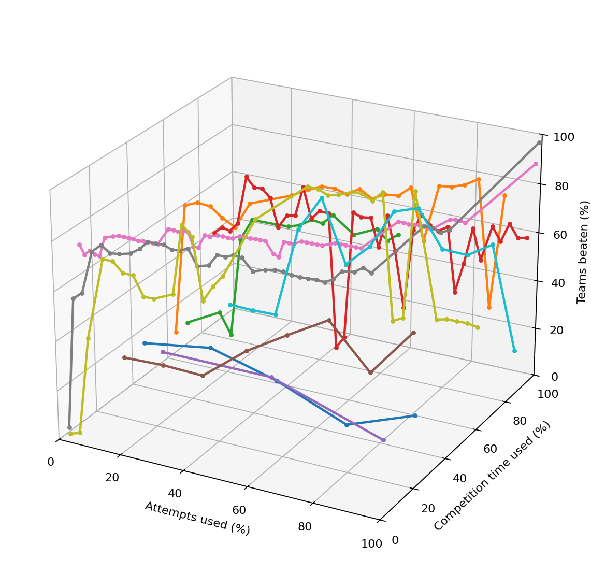

# Kaggle ML Portfolio

This repository is a curated portfolio of Kaggle and ML competition solutions.
Each competition lives in its own folder with the final pipeline, notebooks,
reports, and submission artifacts kept close to the original solution.

The repository is organized for review: the top-level README gives a quick
overview, while each project README explains what to inspect first and how the
solution is structured.

<p align="center">
  <a href="https://flexonafft.github.io/MLKaggleTasks/">
    
  </a>
</p>
<p align="center">
  <sub>3D submission history: X — attempts used, Y — competition time used, Z — teams beaten. <a href="https://flexonafft.github.io/MLKaggleTasks/">Open the interactive graph</a>.</sub>
</p>

## Repository Structure

```text
.
├── competitions/       # Kaggle competition solutions
├── practice/           # Non-Kaggle practice and course tasks
├── scripts/            # Repository maintenance scripts
└── assets/             # Generated charts and shared README assets
```

## Featured Solutions

| Project | Type | Main entry point | Notes |
| - | - | - | - |
| [Predicting Students Test Scores](competitions/predicting-students-test-scores/) | Regression | `pipeline.py` | Full Python pipeline with LightGBM/CatBoost trainers |
| [Thermophysical Melting Point](competitions/thermophysical-melting-point/) | Regression | `pipeline.py` | Modular feature engineering and CatBoost pipeline |
| [Customer Churn](competitions/predicting-customer-churn/) | Binary classification | `train_models.py` | Research report, EDA report, model results |
| [Predicting Loan Payback](competitions/predicting-loan-payback/) | Binary classification | `pipeline.py` | CLI-style train/predict workflow |
| [Astronomical Classification](competitions/astronomical-classification/) | Time-series classification | `pipeline.ipynb` | Multiple notebook experiments including transformer baseline |

## Competition Index

| Project | Status | Primary files |
| - | - | - |
| [Astronomical Classification](competitions/astronomical-classification/) | Experiments + notebook solution | `pipeline.ipynb`, `optimal/transformer.ipynb` |
| [Christmas Tree Packing Challenge](competitions/christmas-tree-packing-challenge/) | Starter notebook | `getting-started.ipynb` |
| [Credit Card Fraud Detection](competitions/credit-card-fraud-detection/) | Notebook solution | `fraud-detection.ipynb` |
| [Customer Churn](competitions/predicting-customer-churn/) | Pipeline + reports | `train_models.py`, `pipeline.ipynb` |
| [LLM Classification Finetuning](competitions/llm-classification-finetuning/) | Baseline pipeline | `pipeline.py`, `notebooks/solution.ipynb` |
| [Predicting Heart Disease](competitions/predicting-heart-disease/) | Baseline notebooks | `mybaseline.ipynb`, `cvbaseline.ipynb` |
| [Predicting Irrigation Need](competitions/predicting-irrigation-need/) | EDA + notebook solution | `irrigation_need_solution.ipynb` |
| [Predicting Loan Payback](competitions/predicting-loan-payback/) | Reproducible pipeline | `pipeline.py`, `catboost_model.py` |
| [Predicting Pit Stop](competitions/predicting-pit-stop/) | Ensemble notebooks | `oopnote.ipynb`, `ensemblenote.ipynb`, `blender.ipynb` |
| [Predicting Students Test Scores](competitions/predicting-students-test-scores/) | Reproducible pipeline | `pipeline.py`, `data.py`, `trainers/` |
| [Rental Product Recommendation](competitions/rental-product-recommendation/) | Preprocessing notebook | `pipeline.ipynb` |
| [Sentiment Tweet Analysis](competitions/sentiment-tweet-analysis/) | Notebook solution | `tweet-analysis.ipynb` |
| [Thermophysical Melting Point](competitions/thermophysical-melting-point/) | Reproducible pipeline | `pipeline.py`, `mlcore/` |

Practice tasks are kept separately under [practice/](practice/).

## Results Tracker

<!-- COMPETITION-TABLE:START -->
| # | Competition | Rank | Total | % beaten | Best score | Source |
| - | - | - | - | - | - | - |
| 1 | Predicting Students Test Score | 624 | 1741 | 64.2% | - | manual |
| 2 | Thermophysical Property: Melting Point | 309 | 1177 | 73.7% | 35.59526 | kaggle |
| 3 | LLM Classification | 153 | 232 | 34.1% | 1.07413 | kaggle |
| 4 | Astronomical Classification | 285 | 894 | 68.1% | 0.5864 | kaggle |
| 5 | Predicting Heart Disease | 70 | 536 | 86.9% | - | manual |
| 6 | Playground Series S6E2 | 2407 | 4371 | 44.9% | 0.95323 | kaggle |
| 7 | Playground Series S6E4 | 1602 | 4316 | 62.9% | 0.96735 | kaggle |
| 8 | Playground Series S6E3 | 2485 | 4143 | 40.0% | 0.91338 | kaggle |
| 9 | Playground Series S5E11 | 2010 | 3726 | 46.1% | 0.92150 | kaggle |
| 10 | Playground Series S6E5 | 303 | 3023 | 90.0% | 0.95453 | kaggle |
| 11 | Biohub Cell Tracking During Development | 297 | 1516 | 80.4% | 0.926 | kaggle |
| 12 | Ai Agent Security Multi Step Tool Attacks | 375 | 2225 | 83.1% | 83.610 | kaggle |
| 13 | Playground Series S6E6 | 66 | 2817 | 97.7% | 0.97259 | kaggle |
| 14 | Playground Series S6E7 | 84 | 2489 | 96.6% | 0.95238 | kaggle |
<!-- COMPETITION-TABLE:END -->

<!-- PROGRESS-CHART:START -->

<p><sub>Last updated: 2026-07-22 15:06</sub></p>
<!-- PROGRESS-CHART:END -->

## Data Policy

Competition datasets are expected to live inside each project as `datasets/` or
`dataset/`, but raw data is not part of the portfolio surface. Most local data,
training logs, caches, and environment files are ignored via `.gitignore`.

Run scripts from inside the project folder unless a project README states
otherwise. This preserves the original Kaggle-style relative paths.

## Contacts

If you have any questions or suggestions for improving my configurations,
please feel free to contact me by email or through GitHub.
