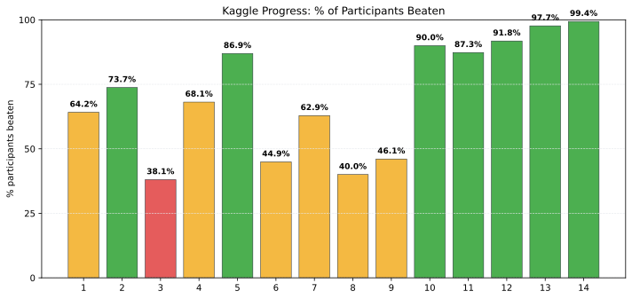

# Kaggle Results Tracker

This repo tracks my Kaggle competition results and visualizes progress as the percentage of participants I beat.

Formula used:

- `percent_beaten = (total - rank) / total * 100`

The script regenerates `assets/progress.svg` with matplotlib and refreshes the chart block below.
If matplotlib is missing, install it with `python3 -m pip install matplotlib`.

## Competitions table

This table is generated from `scripts/competitions.csv`. The chart uses the `#` column on the x-axis.

<!-- COMPETITION-TABLE:START -->
| # | Competition | Rank | Total | % beaten |
| - | - | - | - | - |
| 1 | Predicting Students Test Score | 624 | 1741 | 64.2% |
| 2 | Thermophysical Property: Melting Point | 309 | 903 | 65.8% |
| 3 | LLM Classification | 141 | 238 | 40.8% |
| 4 | AstronomicalClassification | 282 | 810 | 65.2% |
<!-- COMPETITION-TABLE:END -->

<!-- PROGRESS-CHART:START -->

Last updated: 2026-01-25 23:12

<!-- PROGRESS-CHART:END -->